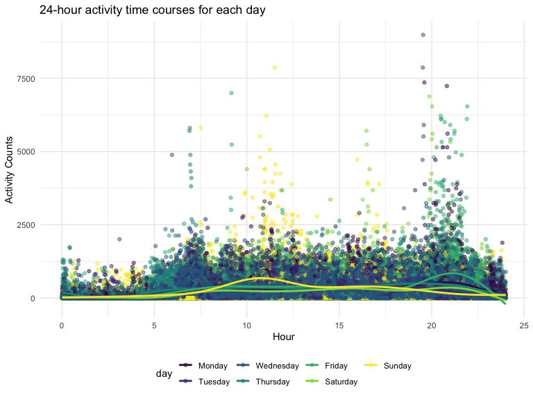
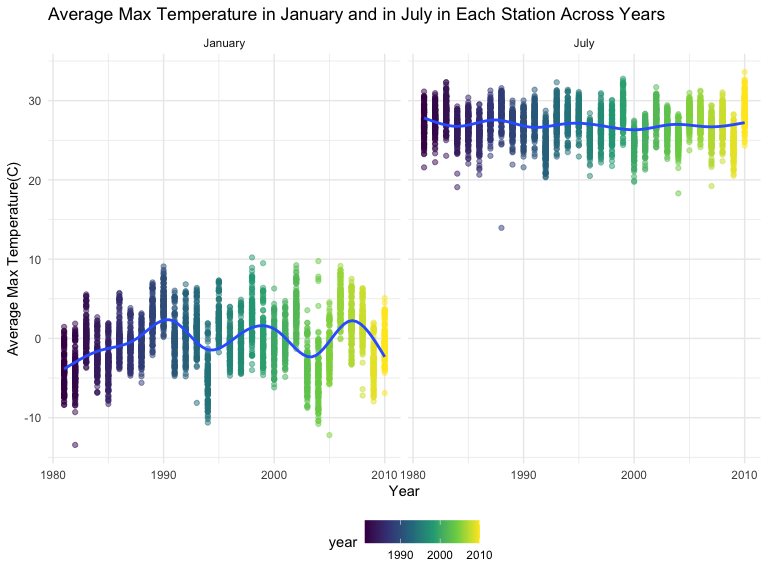
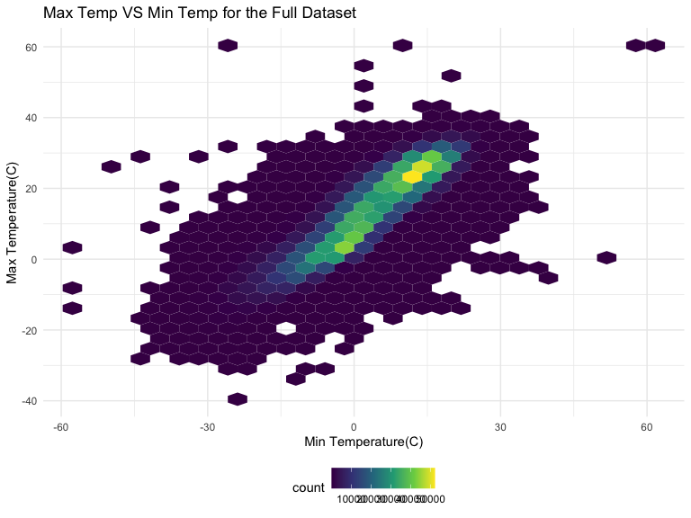
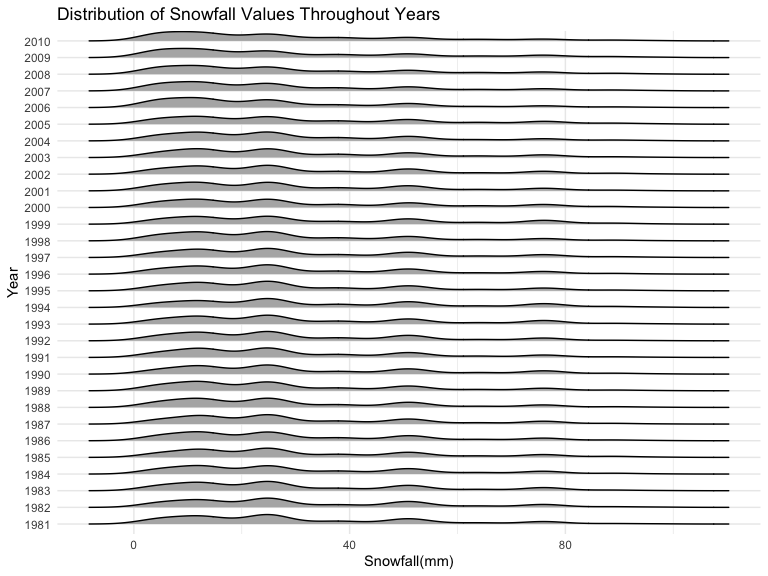

p8105_hw3_jc5924
================

# Problem 1

#### Read in the data

``` r
data("instacart")

instacart = 
  instacart %>% 
  as_tibble(instacart)
```

#### Answer questions about the data

This dataset contains 1384617 rows and 15 columns, with each row
resprenting a single product from an instacart order. Variables include
identifiers for user, order, and product; the order in which each
product was added to the cart. There are several order-level variables,
describing the day and time of the order, and number of days since prior
order. Then there are several item-specific variables, describing the
product name (e.g. Yogurt, Avocado), department (e.g. dairy and eggs,
produce), and aisle (e.g. yogurt, fresh fruits), and whether the item
has been ordered by this user in the past. In total, there are 39123
products found in 131209 orders from 131209 distinct users.

Below is a table summarizing the number of items ordered from aisle. In
total, there are 134 aisles, with fresh vegetables and fresh fruits
holding the most items ordered by far.

``` r
instacart %>% 
  count(aisle) %>% 
  arrange(desc(n))
```

    ## # A tibble: 134 × 2
    ##    aisle                              n
    ##    <chr>                          <int>
    ##  1 fresh vegetables              150609
    ##  2 fresh fruits                  150473
    ##  3 packaged vegetables fruits     78493
    ##  4 yogurt                         55240
    ##  5 packaged cheese                41699
    ##  6 water seltzer sparkling water  36617
    ##  7 milk                           32644
    ##  8 chips pretzels                 31269
    ##  9 soy lactosefree                26240
    ## 10 bread                          23635
    ## # … with 124 more rows

Next is a plot that shows the number of items ordered in each aisle.
Here, aisles are ordered by ascending number of items.

``` r
instacart %>% 
  count(aisle) %>% 
  filter(n > 10000) %>% 
  mutate(aisle = fct_reorder(aisle, n)) %>% 
  ggplot(aes(x = aisle, y = n)) + 
  geom_point() + 
  labs(title = "Number of items ordered in each aisle") +
  theme(axis.text.x = element_text(angle = 60, hjust = 1))
```


Our next table shows the three most popular items in aisles
`baking ingredients`, `dog food care`, and `packaged vegetables fruits`,
and includes the number of times each item is ordered in your table.

``` r
instacart %>% 
  filter(aisle %in% c("baking ingredients", "dog food care", "packaged vegetables fruits")) %>%
  group_by(aisle) %>% 
  count(product_name) %>% 
  mutate(rank = min_rank(desc(n))) %>% 
  filter(rank < 4) %>% 
  arrange(desc(n)) %>%
  knitr::kable()
```

| aisle                      | product_name                                  |    n | rank |
|:---------------------------|:----------------------------------------------|-----:|-----:|
| packaged vegetables fruits | Organic Baby Spinach                          | 9784 |    1 |
| packaged vegetables fruits | Organic Raspberries                           | 5546 |    2 |
| packaged vegetables fruits | Organic Blueberries                           | 4966 |    3 |
| baking ingredients         | Light Brown Sugar                             |  499 |    1 |
| baking ingredients         | Pure Baking Soda                              |  387 |    2 |
| baking ingredients         | Cane Sugar                                    |  336 |    3 |
| dog food care              | Snack Sticks Chicken & Rice Recipe Dog Treats |   30 |    1 |
| dog food care              | Organix Chicken & Brown Rice Recipe           |   28 |    2 |
| dog food care              | Small Dog Biscuits                            |   26 |    3 |

Finally is a table showing the mean hour of the day at which Pink Lady
Apples and Coffee Ice Cream are ordered on each day of the week. This
table has been formatted in an untidy manner for human readers. Pink
Lady Apples are generally purchased slightly earlier in the day than
Coffee Ice Cream, with the exception of day 5.

``` r
instacart %>%
  filter(product_name %in% c("Pink Lady Apples", "Coffee Ice Cream")) %>%
  group_by(product_name, order_dow) %>%
  summarize(mean_hour = mean(order_hour_of_day)) %>%
  spread(key = order_dow, value = mean_hour) %>%
  knitr::kable(digits = 2)
```

    ## `summarise()` has grouped output by 'product_name'. You can override using the
    ## `.groups` argument.

| product_name     |     0 |     1 |     2 |     3 |     4 |     5 |     6 |
|:-----------------|------:|------:|------:|------:|------:|------:|------:|
| Coffee Ice Cream | 13.77 | 14.32 | 15.38 | 15.32 | 15.22 | 12.26 | 13.83 |
| Pink Lady Apples | 13.44 | 11.36 | 11.70 | 14.25 | 11.55 | 12.78 | 11.94 |

# Problem 2

### Load, tidy and wrangle

``` r
accel_df=read_csv("./data/accel_data.csv",show_col_types = FALSE) %>% 
  janitor::clean_names() %>% 
  pivot_longer(
    activity_1:activity_1440,
    names_to="minute",
    names_prefix="activity_",
    values_to="activity count",
  ) %>%
    mutate(
      weekday_vs_weekend=ifelse(day %in% c("Saturday", "Sunday"), "weekend", "weekday"),
      day = fct_relevel(day,"Monday", "Tuesday", "Wednesday","Thursday","Friday", "Saturday", "Sunday"),
      minute=as.numeric(minute)
      )
accel_df
```

    ## # A tibble: 50,400 × 6
    ##     week day_id day    minute `activity count` weekday_vs_weekend
    ##    <dbl>  <dbl> <fct>   <dbl>            <dbl> <chr>             
    ##  1     1      1 Friday      1             88.4 weekday           
    ##  2     1      1 Friday      2             82.2 weekday           
    ##  3     1      1 Friday      3             64.4 weekday           
    ##  4     1      1 Friday      4             70.0 weekday           
    ##  5     1      1 Friday      5             75.0 weekday           
    ##  6     1      1 Friday      6             66.3 weekday           
    ##  7     1      1 Friday      7             53.8 weekday           
    ##  8     1      1 Friday      8             47.8 weekday           
    ##  9     1      1 Friday      9             55.5 weekday           
    ## 10     1      1 Friday     10             43.0 weekday           
    ## # … with 50,390 more rows

### Describe the resultings

-   There are total of 6 key variables in this dataset that are week,
    day_id, day, minute, activity count, weekday_vs_weekend. And there
    are total of 50400 observations. In this dataframe, variables
    activity are the activity counts for each minute of a 24-hour day
    starting at midnight.

### Create a table

``` r
accel_df %>%
  janitor::clean_names() %>% 
  group_by(week,day) %>%
  summarize(
    total_activity=sum(activity_count,na.rm = TRUE)
) %>% 
  pivot_wider(
    names_from = day,
    values_from = total_activity) %>% 
  knitr::kable()
```

    ## `summarise()` has grouped output by 'week'. You can override using the `.groups`
    ## argument.

| week |    Monday |  Tuesday | Wednesday | Thursday |   Friday | Saturday | Sunday |
|-----:|----------:|---------:|----------:|---------:|---------:|---------:|-------:|
|    1 |  78828.07 | 307094.2 |    340115 | 355923.6 | 480542.6 |   376254 | 631105 |
|    2 | 295431.00 | 423245.0 |    440962 | 474048.0 | 568839.0 |   607175 | 422018 |
|    3 | 685910.00 | 381507.0 |    468869 | 371230.0 | 467420.0 |   382928 | 467052 |
|    4 | 409450.00 | 319568.0 |    434460 | 340291.0 | 154049.0 |     1440 | 260617 |
|    5 | 389080.00 | 367824.0 |    445366 | 549658.0 | 620860.0 |     1440 | 138421 |

### Are there any trends?

-   There are a few trends that can be observed that patients’ activity
    level remains fairly stable for the first three weeks, and for week
    4 and week 5, the total activity count drops during the weekends.

### Single panel plot

``` r
accel_df %>% 
  janitor::clean_names() %>% 
  group_by(day,minute) %>% 
  ggplot(aes(x = minute/60,y =activity_count,color = day)) + 
  geom_point(alpha = .5) +
  geom_smooth(se = FALSE)+
  labs(
    x = "Hour",
    y = "Activity Counts",
    title = "24-hour activity time courses for each day")+
  scale_x_continuous(
    limits = c(0, 24))
```

    ## `geom_smooth()` using method = 'gam' and formula 'y ~ s(x, bs = "cs")'



### Describe the pattern

-   We can see generally from Monday to Sunday, there are not many of
    activity count toward 00:00am to 6:00am and the most fluctuations
    occur between 7:00am to 24:00pm. There are two peaks when time are
    around 8:00am to 15:00pm and 18:00pm to 24:00pm. Plus, we can tell
    from the plot that from Friday to Sunday, patients tend to be more
    active than during weekdays.

# Problem 3

### Load and explore

``` r
data("ny_noaa")
ny_noaa
```

    ## # A tibble: 2,595,176 × 7
    ##    id          date        prcp  snow  snwd tmax  tmin 
    ##    <chr>       <date>     <int> <int> <int> <chr> <chr>
    ##  1 US1NYAB0001 2007-11-01    NA    NA    NA <NA>  <NA> 
    ##  2 US1NYAB0001 2007-11-02    NA    NA    NA <NA>  <NA> 
    ##  3 US1NYAB0001 2007-11-03    NA    NA    NA <NA>  <NA> 
    ##  4 US1NYAB0001 2007-11-04    NA    NA    NA <NA>  <NA> 
    ##  5 US1NYAB0001 2007-11-05    NA    NA    NA <NA>  <NA> 
    ##  6 US1NYAB0001 2007-11-06    NA    NA    NA <NA>  <NA> 
    ##  7 US1NYAB0001 2007-11-07    NA    NA    NA <NA>  <NA> 
    ##  8 US1NYAB0001 2007-11-08    NA    NA    NA <NA>  <NA> 
    ##  9 US1NYAB0001 2007-11-09    NA    NA    NA <NA>  <NA> 
    ## 10 US1NYAB0001 2007-11-10    NA    NA    NA <NA>  <NA> 
    ## # … with 2,595,166 more rows

-   In this dataset, there are 7 key variable that are id, date, prcp,
    snow, snwd, tmax, tmin and there are total of 2595176 of
    observations. Plus, there is an issue with missing data that `prcp`
    has 145838 missing values; `snow` has 381221 missing values; `snwd`
    has 591786 missing values; `tmax` has 1134358 missing values and
    `tmin` has 1134420 missing values.

### Tidy, create variables and units

``` r
noaa_df=ny_noaa %>% 
  janitor::clean_names() %>% 
  separate(date,into = c("year","month","day")) %>%
  mutate(year=as.integer(year),
         month=month.name[as.numeric(month)],
         day=as.numeric(day),
         prcp=as.numeric(prcp)/10,
         tmax=as.numeric(tmax)/10,
         tmin=as.numeric(tmin)/10)
noaa_df
```

    ## # A tibble: 2,595,176 × 9
    ##    id           year month      day  prcp  snow  snwd  tmax  tmin
    ##    <chr>       <int> <chr>    <dbl> <dbl> <int> <int> <dbl> <dbl>
    ##  1 US1NYAB0001  2007 November     1    NA    NA    NA    NA    NA
    ##  2 US1NYAB0001  2007 November     2    NA    NA    NA    NA    NA
    ##  3 US1NYAB0001  2007 November     3    NA    NA    NA    NA    NA
    ##  4 US1NYAB0001  2007 November     4    NA    NA    NA    NA    NA
    ##  5 US1NYAB0001  2007 November     5    NA    NA    NA    NA    NA
    ##  6 US1NYAB0001  2007 November     6    NA    NA    NA    NA    NA
    ##  7 US1NYAB0001  2007 November     7    NA    NA    NA    NA    NA
    ##  8 US1NYAB0001  2007 November     8    NA    NA    NA    NA    NA
    ##  9 US1NYAB0001  2007 November     9    NA    NA    NA    NA    NA
    ## 10 US1NYAB0001  2007 November    10    NA    NA    NA    NA    NA
    ## # … with 2,595,166 more rows

### Snowfalls

``` r
noaa_df %>% 
  janitor::clean_names() %>% 
  group_by(snow) %>%
  summarize(observed_value=n()) %>% 
  arrange(desc(observed_value))
```

    ## # A tibble: 282 × 2
    ##     snow observed_value
    ##    <int>          <int>
    ##  1     0        2008508
    ##  2    NA         381221
    ##  3    25          31022
    ##  4    13          23095
    ##  5    51          18274
    ##  6    76          10173
    ##  7     8           9962
    ##  8     5           9748
    ##  9    38           9197
    ## 10     3           8790
    ## # … with 272 more rows

-   The most commonly observed data is 0 meaning that most of the time,
    there appears to be no snow in NY. And there are also large number
    of observed value of missing data for NA.

### Two-panel plot, structure?outliers?

``` r
avg_max_jan_jul=noaa_df %>% 
  group_by(id,year,month) %>% 
  filter(month %in% c("January", "July")) %>% 
  drop_na(tmax) %>% 
  summarise(avg_max=mean(tmax))
```

    ## `summarise()` has grouped output by 'id', 'year'. You can override using the
    ## `.groups` argument.

``` r
avg_max_jan_jul %>% 
  ggplot(aes(x=year, y=avg_max,color=year))+
  geom_point(alpha=.5)+
  geom_smooth(se=FALSE)+
  facet_grid(.~month)+
  labs(
    x="Year",
    y="Average Max Temperature(C)",
    title = "Average Max Temperature in January and in July in Each Station Across Years"
  )
```

    ## `geom_smooth()` using method = 'gam' and formula 'y ~ s(x, bs = "cs")'



-   It is for sure that there is a structure that the avg max
    temperature in Jan is in deed much lower than that in July. Plus, we
    can see the huge fluctuation happening in January throughout the
    years and in July, the flow of avg max temp tend to be stable. There
    are indeed some outliers both in January and July throughout the
    years.

### two-panel plot for tmaxVtmin and distribution of snowfalls

#### tmaxVtmin

``` r
tmaxVtmin=noaa_df %>%
  ggplot(aes(x=tmin,y=tmax,color=year))+
  geom_hex(scale=.6) + 
  labs(x="Min Temperature(C)", 
       y="Max Temperature(C)",
       title="Max Temp VS Min Temp for the Full Dataset") 
tmaxVtmin
```


\#### Snowfalls

``` r
snowfall=noaa_df %>% 
  filter(snow>0&snow<100) %>%
  ggplot(aes(x=snow, y=as.factor(year)))+
  geom_density_ridges(scale=.6) + 
  labs(x = "Snowfall(mm)",
             y = "Year",
             title = "Distribution of Snowfall Values Throughout Years")
snowfall
```

    ## Picking joint bandwidth of 3.76


